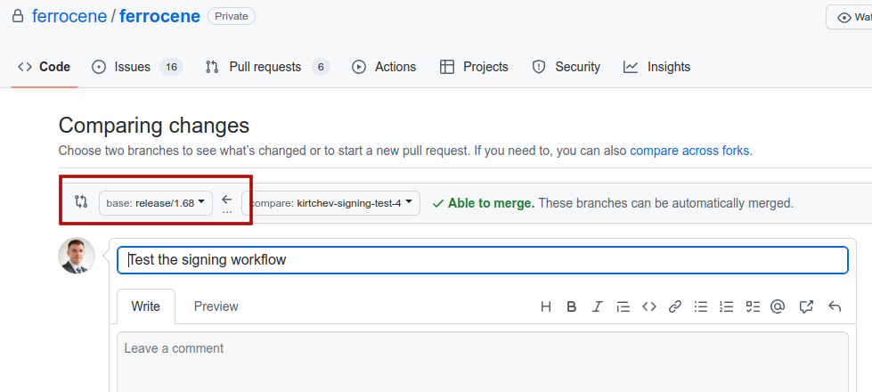

.. SPDX-License-Identifier: MIT OR Apache-2.0
   SPDX-FileCopyrightText: The Ferrocene Developers

Documentation procedures
========================

The following procedures describe the means of building, updating, validating,
and signing documents as per the appropriate level of quality.

Document process
----------------

The document process has been described in the :doc:`qualification-plan:index`.
The procedures describe how documentation is imported to GitHub as well as the
verification process used to verify the buildability and correctness of the
content.

See the following chapters for the detailed process:

* :doc:`qualification-plan:documentation`

Working on the documentation
----------------------------

Qualification and QMS documents are built with Sphinx, and their source code is
located in the ``ferrocene/doc`` folder inside the Ferrocene repository. For
example, the source of the Safety Manual is located in
``ferrocene/doc/safety-manual``.

The Ferrocene build system takes care of building and cross-linking the
qualification and QMS documents, including downloading all the required
dependencies. Building the documents outside of the Ferrocene build system
(including building them with the standard Sphinx CLI) is not supported and will
likely not work.

Building documents
~~~~~~~~~~~~~~~~~~

You can build a qualification document by passing its path to the Ferrocene
build system:

.. code-block:: text

   ./x doc ferrocene/doc/$name

You can also build multiple documents at the same time by passing all of their
paths:

.. code-block:: text

   ./x doc ferrocene/doc/$foo ferrocene/doc/$bar ferrocene/doc/$baz

If you want to build all of the available documentation, you can omit the path:

.. code-block:: text

   ./x doc

The build system will output the path containing the resulting documents. You
can also open the built documents in your browser by passing the ``--open``
flag:

.. code-block:: text

   ./x doc ferrocene/doc/$foo --open

Defining and linking to IDs
~~~~~~~~~~~~~~~~~~~~~~~~~~~

Our qualification documents contain IDs defining every concept and item
referenced across our qualification material for example - ``ERR_DRIVER_04``.
The ``ferrocene_qualification`` Sphinx extension provides a directive and a role
to respectively declare and link to an ID.

To declare a new ID, you can use the ``id`` directive:

.. code-block:: text

   .. id:: FOO

That directive will define an ID named ``FOO``, and it will render it as
"**Identifier:** ``FOO``" (inside of tables it will just render it as "``FOO``"
to reduce clutter).

To link to an ID, you can use the ``id`` role:

.. code-block:: text

   :id:`FOO`

This will create a link pointing to the definition you created earlier.
Note that linking to IDs works transparently across all of our qualification
material, without having to mention the document the ID was defined in. You can
just reference an ID defined in a different document like you would link to an
ID defined in the same document.

Using substitutions
~~~~~~~~~~~~~~~~~~~

Across our documentation there are terms or phrases referenced multiple times.
Substitutions allow you to create "aliases" for common phrases you can include
in any qualification document.

Substitutions are defined in the ``ferrocene/doc/sphinx-substitutions.toml``
file. There are also the following substitutions, which are calculated
dynamically:

* ``doc_title``: the name of the document (e.g. Safety Manual)

* ``doc_short_title``: the acronym of the document (e.g. SM)

You can refer to substitutions across all of our documentation  by surrounding 
the substitution name with ``|``:

.. code-block:: text

   |doc_title|

Signing documents
-----------------

All the qualification documents we send to TUV have to be digitally signed by
the responsible parties, to attest they were reviewed and to prevent accidental
changes to the documents (which would require TUV to review the documents
again). 

The Ferrocene QMS documentation also needs to be digitally signed by
responsible parties to attest that their contents are up to date and represent
the latest applicable procedures to be applied throughout the organization.

We developed a small wrapper around the "cosign" tool to make it easy to
sign our qualification documents.

To sign a document, you need to run this command inside of
``ferrocene/ferrocene``:

.. code-block:: text

   ./x sign $path

For example:

.. code-block:: text

   ./x sign ferrocene/doc/evaluation-report

Running the command will:

* Build the document locally to calculate its document ID and the hash of the
  generated files.

* Download the expected version of cosign, if it was not downloaded before.

* Invoke cosign to digitally sign the document metadata gathered earlier.

When cosign is invoked, you will need to:

* Agree to your company email address being published in the Rektor transparency
  log.

* In the browser window that opened, select "Microsoft".

* Authenticate with your company email credentials.

This will generate an ephemeral code signing certificate for your company email
address and sign the contents of the document with it. Once that's done, commit
the new files generated by the signing tool.

Verifying signatures
--------------------

You can verify that all the present signatures are still valid with this
command:

.. code-block:: text

   ./x test ferrocene-check-document-signatures

.. Note::
   When running the command locally, you might get signature verification errors
   if some of the cached pages built locally are out of date. To fix them,
   remove the ``build/`` directory.

It is also possible to inspect the ephemeral code signing certificate of a
signature with this command:

.. code-block:: text

   jq .cert $path/signature/$role.cosign-bundle -r | base64 -d | openssl x509 -text

Signing workflow
----------------

The following workflow considers that two different people are signing the
document. If the number of signees is greater than 2, then the steps of
:ref:`doc-procedures:Signee 2` can be repeated.

For qualification documents, :ref:`doc-procedures:Signee 1` is the
Verification Engineer and
:ref:`doc-procedures:Signee 2` is the
Certification Engineer.

Signee 1
~~~~~~~~

1. Perform Setting up a local development environment from this document.

2. Go to your checkout of ``ferrocene/ferrocene``.

3. Create a signing branch by executing

.. code-block:: text

   git fetch
   git checkout -b <branch_name> origin/release/1.68

where ``<branch_name>`` denotes the name of the signing branch, for example
``sign-evaluation-plan``.

4. Update tool submodules by executing

.. code-block:: text

   	git submodule update

5. Perform Signing documents from this document.

6. Check that files ``verifier.cosign-bundle`` and
   ``verifier.cosign-bundle.license`` have been created by executing

.. code-block:: text

   git status

7. Prepare a PR by executing

.. code-block:: text

   git add .
   git commit

8. Add title ``Sign <document>`` to the commit message, where ``<document>`` is
   the document you just signed, for example ``Sign Evaluation Plan``.

9. Save and exit your editor.

10. Push the branch to GitHub:

.. code-block:: text

   git push -u origin <branch_name>

11. Follow the URL to GitHub, and create the PR.

12. Update the base branch to ``release/1.68`` in the GitHub UI by selecting it
    from the dropbox, as shown below:

   pr-chose-base-branch

13. Notify the Certification Engineer that the PR has been created, and give
    the ``<branch_name>``.

Signee 2
~~~~~~~~

1. Perform Setting up a local development environment from this document.

2. Go to your checkout of ``ferrocene/ferrocene``.

3. Check out the signing branch by executing

.. code-block:: text

   git checkout <branch_name>

where ``<branch_name>`` denotes the name of the signing branch, for example
``sign-evaluation-plan``.

4. Update tool submodules by executing

.. code-block:: text

   	git submodule update

5. Perform Signing documents from this document.

6. Check that files ``engineer.cosign-bundle`` and
   ``engineer.cosign-bundle.license`` have been created by executing

.. code-block:: text

   git status

7. Prepare a commit by executing

.. code-block:: text

   git add .
   git commit

8. Add title ``Sign <document>`` to the commit message, where ``<document>`` is
   the document you just signed, for example ``Sign Evaluation Plan``.

9. Save and exit your editor.

10. Push your commit by executing

.. code-block:: text

   git push

11. Request a review of the PR on Ferrous Systems' ``highfive`` Zulip channel.
