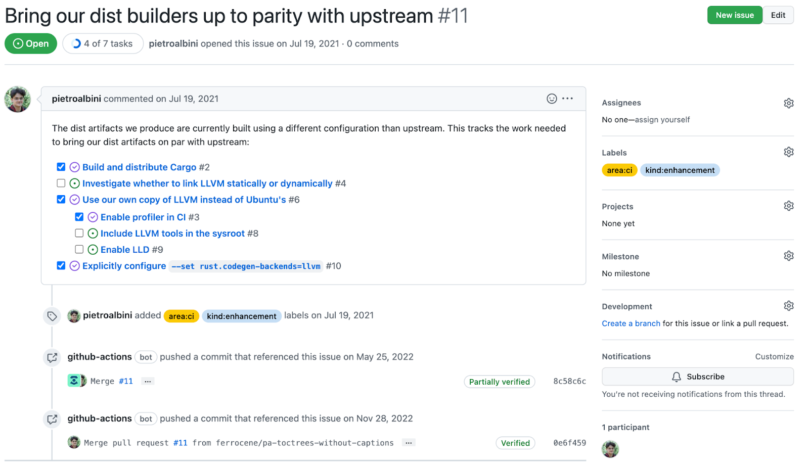
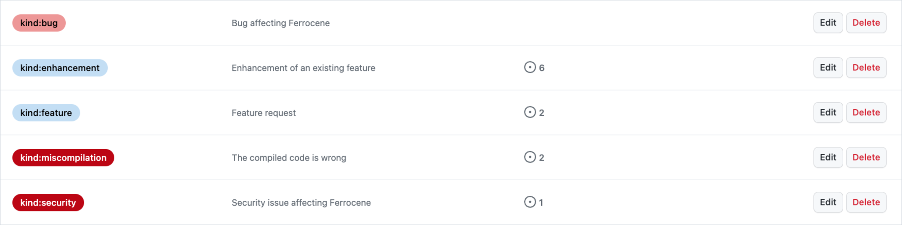
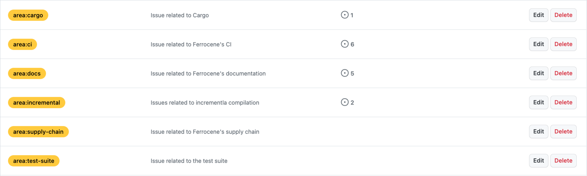
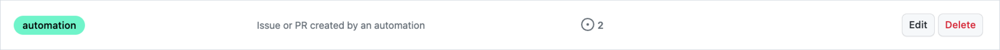
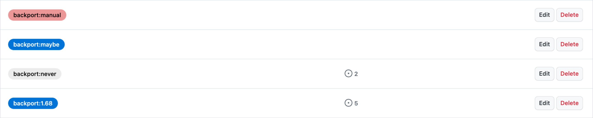
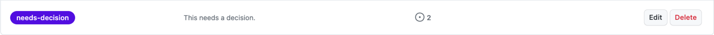

.. SPDX-License-Identifier: MIT OR Apache-2.0
   SPDX-FileCopyrightText: The Ferrocene Developers

GitHub Issues
=============

What is a GitHub issue
----------------------

A GitHub Issues is a means of communication integrated into the GitHub workflow.
They allow you to track ideas, feedback, tasks, or bugs. Issues can reference
any step of the development cycle and can also be referenced to by other issues
and Pull Requests.

   GitHub issue example

Issues can also be prioritized and associated to different projects through the
use of labels. See :ref:`issues:Labels` for the list of used labels.

Who can create a GitHub Issue
-----------------------------

Anyone can create a GitHub issue.

Issues require followup actions to be performed, so only create issues when an
action is required (e.g. development projects, or improvement requests).

For other discussions or informal communication, the dedicated Zulip channels
or email should be used.

Labels
------

GitHub uses labels as a means to identify and classify Issues and Pull Requests.
Taking advantage of this property, Ferrocene processes use labels as a means
to communicate the type and importance of the issue.

In addition, certain labels are used by the CI automatons to perform certain
actions.

The following labels are available:

* Kind

  * Defines the scope of the issue and the type of support that is required to
    solve it

   Kind labels

* Area

  * Defines affected tool or artifact

   Area labels

* Automation

  * Not to be used manually

  * Label states that the issue or PR is made by CI automation

   Automation label

* Backporting

  * States if the PR or other change should be considered and reviewed for
    backporting to earlier version of the product or not

  * Backporting labels are used by an automation tool to automatically backport
    PRs twice a day.

   Backporting label

* Needs-decision

  * Usually associated with enhancement or large changes

  * States that there is a need for higher level support for deciding whether an
    action needs to be carried out.

    * E.g. CI changes, or new feature enhancements may need to be validated
      with the product owner or project manager to ensure it is inline with the
      current objectives.

   Decision-needed label

Each property is used to identify the scope of the issue and to facilitate
assigning the right person or team to the associated task.

Issue Workflow
--------------

The Ferrocene engineering team uses GitHub issues to track Ferrocene
workflow. These are opened for product enhancement requests, bugs fixes, and
any other development activity.

GitHub issues can also be cross-referenced in other issues or PRs for tracking
of development activities. If an issue is associated with a PR, when the pull
request merges, the linked issue automatically closes.

Opening a GitHub Issue
~~~~~~~~~~~~~~~~~~~~~~

Opening a GitHUb issue is applicable for internal requests linked to the
Ferrocene product (compiler and all of its associated artifacts). Any person
with access to the Ferrocene GitHub repository is able to open a GitHub
issue.

To open an issue, it is recommended to follow the steps outlined by the
`GitHub manual <https://docs.github.com/en/issues/tracking-your-work-with-issues/creating-an-issue>`_.

GitHub issues "best practices" include:

* Choose the most appropriate people to add to the issue. For information on
  team leads, refer to Ferrocene Organization document (add link)

* The subject line should include a meaningful short description of the topic
  (<= 56 characters).

* The ‘Description' should state what the issue is about, and should therefore
  not be empty or delayed. Code, PRs, test results, and emails can also be
  referenced in the description to help the understanding of the problem.

* Labels for each type of category should be added. The issue type allows to
  determine the origin and nature of the problem, and the priority allows to
  clearly identify the resources required and to maintain a good support policy
  for customers.

It is important to follow these guidelines so that people can decide based
on their first reading of the issue, whether they are the appropriate person
or team to respond to the issue. Also, the urgency is important since it may
require additional effort to remain within the necessary timeframe for closing
the issue.

Storing of issues
~~~~~~~~~~~~~~~~~

GitHub issues are automatically stored on the GitHub platform indefinitely. It
is also possible to filter and search for issues using the search bar on the
main page of the ferrocene/ferrocene repository.

Closing a GitHub Issue
~~~~~~~~~~~~~~~~~~~~~~

Anyone can close an issue they opened. Repository owners, and collaborators with
triage permissions or greater can also close issues opened by others.

When closing an issue, it is mandatory to provide the reason for doing so.
If an issue is associated with a PR, then the PR merge is a valid reason.

Before closing an issue, it is necessary to check the following points:

* All outstanding questions and requests have been answered

* A reason for closing has been provided
