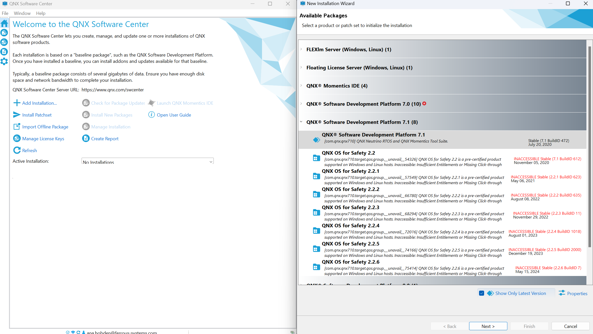

.. SPDX-License-Identifier: MIT OR Apache-2.0
   SPDX-FileCopyrightText: The Ferrocene Developers

QNX
===

One of the partner projects of Ferrocene is `QNX
<https://blackberry.qnx.com/>`_, an embedded real-time OS commonplace in automotive,
medical applications, automated manufacturing, trains, and more.

This page contains the information relevant to Ferrous Systems employees
working on Ferrocene.

.. note::

    QNX only supports :target:`x86_64-unknown-linux-gnu` and
    :target:`x86_64-pc-windows-msvc` as host platforms.

    QNX does not support :ref:`aarch64-apple-darwin` as a host platform.

Windows Setup
-------------

First, ensure you have a `myQNX
<https://www.qnx.com/account/index.html>`_ account and that a
**QNX Software Development Platform Subscription - Developer License**
is deployed to it.

Then, download the `QNX Software Center
<https://www.qnx.com/download/group.html?programid=29178>`_ for Windows and
run it.

An InstallShield installer will run as administrator. Choose a location
to install QNX, we use ``D:\qnx`` for the rest of this guide.

.. note::

    If you are uncomfortable with the Windows GUI, you may instead
    follow the Linux instructions (with minor modifications) below using the
    ``D:\qnx\QNX Software Center\qnxsoftwarecenter_clt.bat`` in place of
    ``qnxsoftwarecenter_clt.sh`` in Powershell, Nushell, or cmd.exe.

After, you can launch the "QNX Software Center" application from the Start
Menu.

Log in, if prompted.

Select "Add Installation...".

Expand the "QNX® Software Development Platform 7.1" section.

Select "QNX® Software Development Platform 7.1" and ensure the version is
"Stable (7.1 BuildID 472)", you may need to uncheck "Show Only Latest Version"
at the bottom of the window:

    QNX SDP Installation

The software will now prompt you to select a license key, select the previously
deployed **QNX Software Development Platform Subscription - Developer
License**.

Choose an installation folder, we use ``D:\qnx\qnx710`` for the rest of this
guide.

In the "Install" screen, "QNX® Software Development Platform 7.1" should be
selected. Hit "Next >", then hit "Finish".

QNX Software Center will now download the toolchain. A summary will be
produced after, dismiss it when you are satisfied.

Your installation will be located in the installation folder you chose.
For example, ``D:\qnx\qnx710``.

Linux Setup
-----------

First, ensure you have a `myQNX
<https://www.qnx.com/account/index.html>`_ account and that a
**QNX Software Development Platform Subscription - Developer License**
is deployed to it.

Then, download the `QNX Software Center
<https://www.qnx.com/download/group.html?programid=29178>`_ for Linux. In the
below example, the downloaded ``.run`` file has been saved as
``$HOME/qnx-software-center.run``

.. code-block::

    cd $HOME
    chmod +x qnx/qnx-software-center.run
    qnx/qnx-software-center.run --tar xvf -C qnx

.. note::

    If you are uncomfortable with the Linux command line, a GUI is available.
    You may instead run `./qnx/qnxsoftwarecenter/qnxsoftwarecenter` and
    follow the Windows instructions above, starting from "Log in, if
    prompted" now.

Then, install QNX 7.1.0 BuildID 472:

.. code-block::

    LICENSE_KEY="FILL_ME_IN"
    QNX_USER="FILL_ME_IN"
    QNX_PASSWORD="FILL_ME_IN"
    QNX_VERSION="7.1.0.00472T202006132107S"

    cd $HOME/
    qnx/qnxsoftwarecenter/qnxsoftwarecenter_clt \
        -myqnx.user $QNX_USER -myqnx.password $QNX_PASSWORD \
        -activateLicenseKey $LICENSE_KEY
    qnx/qnxsoftwarecenter/qnxsoftwarecenter_clt \
        -myqnx.user $QNX_USER -myqnx.password $QNX_PASSWORD \
        -mirrorBaseline qnx710-472
    qnx/qnxsoftwarecenter/qnxsoftwarecenter_clt \
        -myqnx.user $QNX_USER -myqnx.password $QNX_PASSWORD \
        -installBaseline com.qnx.qnx710/$QNX_VERSION \
        -destination qnx/qnx710-472 \
        -cleanInstall

Finally, you can source your QNX toolchain in ``bash``:

.. code-block::

    cd $HOME/
    source qnx/qnx710/qnxsdp-env.sh
    qcc

If everything is working, the output of ``qcc`` should be:

.. code-block::

    $ qcc
    cc: no files to process

.. note::

    You need to source this in any shell you wish to use QNX in. You may wish
    to add ``source $HOME/qnx/qnx710/qnxsdp-env.sh`` to your ``~/.bashrc``

Creating a CI/CD deployment
---------------------------

.. note::
    These instructions are are intended to be run on a x86_64 Linux host only.
    `WSL2 <https://learn.microsoft.com/en-us/windows/wsl/install>`_ or `Lima
    <https://github.com/lima-vm/lima>`_ work sufficiently if needed.

QNX artifacts are built using a 'deployment' of QNX which contains a license
provided by QNX for our CI/CD.

.. warning::
    This license may not be used for individual development. Ferrocene also
    has several individual licenses available for developers. To
    obtain one, ask your manager.

To create the deployment, first, ensure you have a `myQNX
<https://www.qnx.com/account/index.html>`_ account and that a
**QNX Software Development Platform Subscription - Build Server License**
is deployed to it.

Download the `QNX Software Center (for Linux Hosts)
<https://www.qnx.com/download/group.html?programid=29178>`_ and place it in
``qnx/qnx-software-center.run``.

Install the QNX Software Center:

.. code-block::

    chmod +x qnx/qnx-software-center.run
    qnx/qnx-software-center.run --tar xvf -C qnx

Create a deployment containing Linux and Windows toolchains:

.. code-block::

    LICENSE_KEY="FILL_ME_IN"
    QNX_USER="FILL_ME_IN"
    QNX_PASSWORD="FILL_ME_IN"
    QNX_VERSION="7.1.0.00472T202006132107S"
    QNX_HOST_VERSION="0.0.2.00472T202006132107S"
    QNX_BSP_VERSION="0.0.3.00010T202012081457E"

    qnx/qnxsoftwarecenter/qnxsoftwarecenter_clt \
        -myqnx.user $QNX_USER -myqnx.password $QNX_PASSWORD \
        -activateLicenseKey $LICENSE_KEY
    qnx/qnxsoftwarecenter/qnxsoftwarecenter_clt \
        -mirrorBaseline qnx710
    qnx/qnxsoftwarecenter/qnxsoftwarecenter_clt \
        -installBaseline com.qnx.qnx710/$QNX_VERSION \
        -installPackage com.qnx.qnx710.host.win.x86_64/$QNX_HOST_VERSION \
        -installPackage com.qnx.qnx710.host.linux.x86_64/$QNX_HOST_VERSION \
        -installPackage com.qnx.qnx710.bsp.xilinx_xzynq_zcu102/$QNX_BSP_VERSION \
        -destination qnx/qnx710-472 \
        -cleanInstall
    qnx/qnxsoftwarecenter/qnxsoftwarecenter_clt \
        -deploySdpInstallation qnx/qnx710-472 \
        -deployLicense $LICENSE_KEY \
        -installationDeployAs qnx/qnx710-472-deployment

Finally, create an archive of the deployment (with dereferenced symlinks) and upload it to the S3 URL which the CI attempts to pull from:

.. code-block::

    cd $HOME
    tar -cv --dereference -I 'zstd -T0' -f qnx/qnx710-472-deployment.tar.zst -C qnx/qnx710-472-deployment/ qnx710-472
    aws s3 cp qnx/qnx710-472-deployment.tar.zst s3://ferrocene-ci-mirrors/manual/qnx/qnx710-472-deployment.tar.zst

On CI/CD hosts we use a Python script to setup the toolchain:

.. code-block::

    cd $HOME
    ferrocene/ci/scripts/cache.py retrieve s3://ferrocene-ci-mirrors/manual/qnx/qnx710-472-deployment.tar.zst .
    source qnx/qnx710-472/qnxsdp-env.sh
    qcc -v

It's also possible to use ``tar`` directly, but it can be problematic on Windows hosts.

.. code-block::

    cd $HOME
    aws s3 cp s3://ferrocene-ci-mirrors/manual/qnx/qnx710-472-deployment.tar.zst - | tar -x --zstd -f-
    source qnx/qnx710-472/qnxsdp-env.sh
    qcc -v
