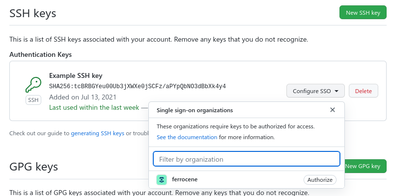
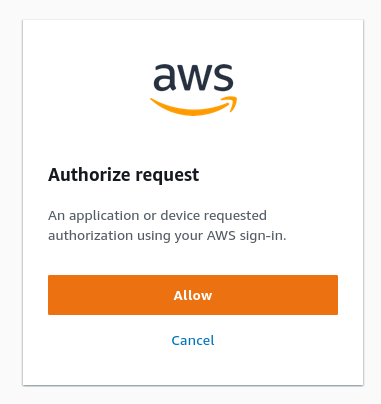

.. SPDX-License-Identifier: MIT OR Apache-2.0
   SPDX-FileCopyrightText: The Ferrocene Developers

Setting up a local development environment
==========================================

Required software
-----------------

To develop Ferrocene locally, you’ll need to have the software required to build
Rust, as well as the following:

* ``git``, as the version control system used by Ferrocene.

* ``uv``, to manage the environment used to build the documentation. `Installation
  instructions. <https://docs.astral.sh/uv/getting-started/installation/>`_

* ``AWS CLI v2``, version **2.9.0 or greater**, needed to interact with our AWS
  account. Note that most Linux distributions only include version 1 of the AWS
  CLI, while we explicitly require version 2.

:target-with-tuple:`x86_64-unknown-linux-gnu`
^^^^^^^^^^^^^^^^^^^^^^^^^^^^^^^^^^^^^^^^^^^^^^

Ubuntu
++++++

On Ubuntu 24.10, install the software requirements by running:

.. code-block:: bash

   sudo apt install ninja-build bzip2 cmake gcc g++ awscli zlib1g-dev
   curl -LsSf https://astral.sh/uv/install.sh | sh

.. note::

   On versions earlier than Ubuntu 24.10 the ``awscli`` package is not newer than
   2.9.0, and should not be used.

Other linux distribution
++++++++++++++++++++++++

To install the requirements on other distributions, adapt the command for the relevant package manager and any modified package names.

Arch
''''

For example, on Arch Linux ``awscli`` can be obtained from the
`AUR <https://aur.archlinux.org/packages/aws-cli-v2>`_, and the remaining packages
from the official repositories:

.. code-block:: bash

   sudo pacman -S ninja bzip2 cmake gcc uv

Fedora
''''''

.. code-block:: bash

   sudo dnf install awscli cmake g++ gcc ninja-build zlib-devel

:target-with-tuple:`aarch64-apple-darwin`
^^^^^^^^^^^^^^^^^^^^^^^^^^^^^^^^^^^^^^^^^^

If you don't already have XCode set up, get the XCode command line tools as
described in :doc:`user-manual:targets/aarch64-apple-darwin`, then use
`Homebrew <https://brew.sh/>`_ to install the remaining dependencies.

To install Homebrew:

.. code-block:: bash

   /bin/bash -c "$(curl -fsSL https://raw.githubusercontent.com/Homebrew/install/HEAD/install.sh)"

Then use Homebrew to install the remaining packages:

.. code-block:: bash

   brew install ninja bzip2 cmake awscli uv gnu-tar

:target-with-tuple:`x86_64-pc-windows-msvc`
^^^^^^^^^^^^^^^^^^^^^^^^^^^^^^^^^^^^^^^^^^^^

.. note::

   Ferrocene development is only supported on Windows 11 Pro with
   `"Developer Mode" <https://learn.microsoft.com/en-us/windows/apps/get-started/enable-your-device-for-development#activate-developer-mode>`_
   enabled.

If you don't already have Visual Studio installed, get the build tools as guided
in :doc:`user-manual:targets/x86_64-pc-windows-msvc`, then use ``winget`` to
install the remaining dependencies:

.. code-block:: bash

   winget install astral-sh.uv Kitware.CMake Ninja-build.Ninja Amazon.AWSCLI

Configuring git
---------------

You need to have an SSH key registered in your GitHub account to be able to
clone the Ferrocene repository. You can check out `GitHub’s documentation
<https://docs.github.com/en/authentication/connecting-to-github-with-ssh>`_ if
you don’t already have an SSH key configured in your account and your local
machine.  If you need to generate a new key as part of the process, please
follow `GitHub’s recommendations
<https://docs.github.com/en/authentication/connecting-to-github-with-ssh/generating-a-new-ssh-key-and-adding-it-to-the-ssh-agent#generating-a-new-ssh-key>`_
to generate a secure key.

Once the SSH key is registered in your GitHub account, you need to authorize it
for the Ferrocene organization using your SSO session. To do so, visit the
`SSH and GPG keys <https://github.com/settings/keys>`_  page of the GitHub
settings, and next to the key you use on your work device click “Configure SSO”.
Finally, click “Authorize” next to “ferrocene” and follow the prompt to enable
the SSH key to access repositories in the Ferrocene organization.

   Add SSH key to GitHub profile

Configuring AWS CLI
-------------------

To authorize the AWS CLI to access our AWS resources, you need to add the
following snippet to the ``~/.aws/config`` (``C:\Users\USERNAME\.aws\config`` on Windows) file
in your work device:

.. code-block:: text

   [profile ferrocene-ci]
   sso_session = ferrous-systems
   sso_account_id = 886866542769
   sso_role_name = FerroceneDeveloper
   region = us-east-1

   [sso-session ferrous-systems]
   sso_start_url = https://ferrous-systems.awsapps.com/start
   sso_region = eu-central-1

.. Note::

   If you do not already have the ``~/.aws/config`` file in your local system,
   create a blank one.

   If you already have the ``[sso-session ferrous-systems]`` block in your
   ``~/.aws/config`` you do not need to add it again, as only one copy of it is
   required.

.. _aws-auth:

Once that's done, you can log into the CLI with the following command:

.. code-block:: text

   aws sso login --profile ferrocene-ci

This will open your browser (if that doesn't happen, click the link displayed
by the command). Authenticate with SSO on that page (if prompted) and click
"Approve":

    AWS SSO log in prompt

.. Note::

   You will need to authenticate with AWS SSO every week. The Ferrocene build
   system will remind you to authenticate if you're trying to perform actions
   that require AWS access but you didn't log in that week.

Cloning the Ferrocene repository
--------------------------------

To clone the Ferrocene repository, you can run this command:

.. code-block:: text

   git clone git@github.com:ferrocene/ferrocene.git

This will take a while to complete (as it is downloading the whole history), and
will create a ``ferrocene/`` directory inside the current directory.

Configuring the Ferrocene build system
--------------------------------------

The Ferrocene build system requires a configuration file to be present at
the root of the repository, in a file named ``config.toml``. You should put this
content in it:

.. code-block:: text

   profile = "compiler"
   change-id = 102579

   [ferrocene]
   aws-profile = "ferrocene-ci"
   test-outcomes = "download-ci"
   coverage-outcomes = "download-ci"

   [rust]
   lld = true

There are a lot of other options available: you can look at the documentation
for all of them in the ``bootstrap.toml.example`` file for further details.

.. note::

   Starting from Rust 1.87, upstream renamed ``config.toml`` to
   ``bootstrap.toml``, retaining support for the old name to avoid breaking
   compatibility. For Ferrocene we recommend continuing to name your
   configuration file ``config.toml``: this way, your settings will still
   apply even on older branches.
