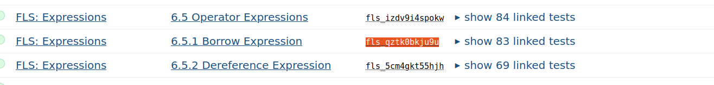
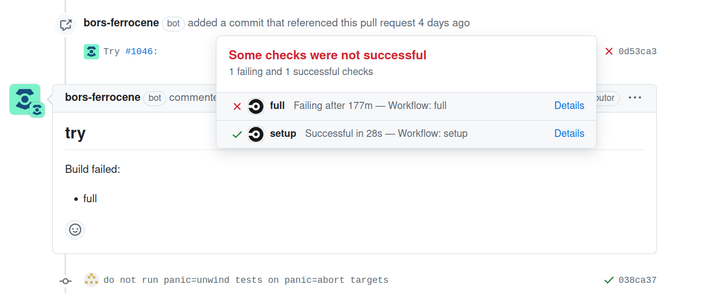
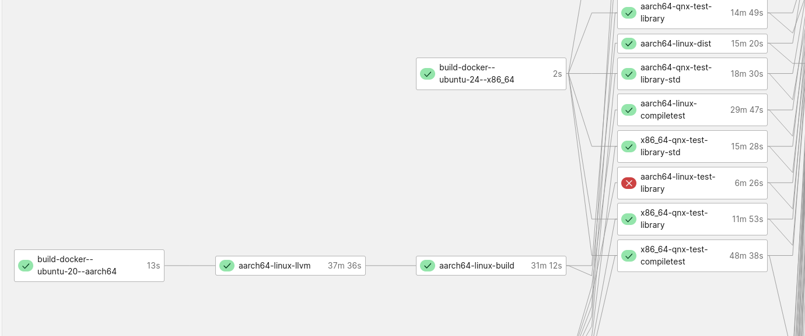

.. SPDX-License-Identifier: MIT OR Apache-2.0
   SPDX-FileCopyrightText: The Ferrocene Developers

Upstream Pulls
==============

What is an Upstream Pull
------------------------

An "upstream pull" is a pull request that pulls in commits from the upstream Rust
repository back into the Ferrocene repository to keep them in sync. This
procedure is usually performed by a periodic Github Action that opens a pull
request automatically. Sometimes merge conflicts may occur in which case the conflict
needs to to be resolved manually.

Upstream Pull without merge conflicts
-------------------------------------

To sign off a automatic upstream pull without merge conflicts, the reviewer only
needs to approve the PR and comment `bors merge`. This will trigger the "full" CI
workflow. If the workflow succeeds, the Upstream Pull is getting merged.

Upstream Pull with merge conflicts
----------------------------------

If an automatic upstream pull creates merge conflicts, the automation commits the
merge conflicts and they need to be resolved manually.

Checkout PR
^^^^^^^^^^^

Start by checking out the PR. The name of the branch is
`automation/pull-upstream/<ID>`, e.g. `automation/pull-upstream/dfvjj2s4`::

    git fetch
    git switch automation/pull-upstream/<ID>

Fix conflict
^^^^^^^^^^^^

To find the conflicting files locally, run the following command::

  ferrocene/ci/scripts/detect-conflict-markers.py

There are multiple kinds of merge conflicts:

General conflict
""""""""""""""""

For general conflicts, the output will look similar to this::

  compiler/rustc_abi/Cargo.toml: conflict between lines 18 and 20

Fix the conflict manually and stage the changed files::

  git add <FILE_1> <FILE_2> # stages file(s)

If code needs to be added or modified for Ferrocene needs, leave a comment
to track the change easily.

Deletion conflict
"""""""""""""""""

For deletion conflicts, the output will look similar to this::

  compiler/rustc_abi/src/layout.rs: file deleted by one side of the merge

This conflict happens when we made changes to a file and it gets deleted by
upstream.

Usually this is solved by removing the file::

  git rm <FILE_1> <FILE_2> # removes file(s) and stages that change

Apart from deleting the file, it is necessary to make sure that the purpose we
changed the file for is preserved. For example if we changed a bootstrap file,
we need to port this change to another file. Usually this change needs to
happen in the same PR.

In the majority of cases, the deleted file is a test which is renamed or moved. In that case, the annotations must be transferred to the moved or renamed test. 
If the test with annotations was just deleted, it is necessary to go to the traceability-matrix and see whether the behavior is still covered by another test.
That is, the tag is still listed in another test.

As an example, upstream deleted the file `tests/ui/consts/miri_unleashed/mutable_references_err.rs`:

.. code-block:: rust

   <<<PULL-UPSTREAM>>> file deleted upstream; move the Ferrocene annotations if any, and delete this file
  // ... 
  // ferrocene-annotations: fls_qztk0bkju9u
  // Borrow Expression
  // ...

Please make sure that the fls annotation still exists:

   fls_qztk0bkju9u is still present in 83 tests

If an annotation is lost, another test that covers that behavior should be found.
This can be done in a subsequent PR.

Unknown conflicts and new errors
"""""""""""""""""""""""""""""""" 

When an error previously unknown appears, such as a library not being found,
try to isolate the faulty process that triggered it with `ferrocene/ci/split-tasks.py`. 
The list of possible jobs can be found in `.circleci/workflow.yml`.

Then check upstream for related fixes. If the failure was solved later, close the current PR
and pull a new one, including the fix.

Blessing
""""""""

Sometimes, the output of `stderr` has changed upstream.

Run ``x test tests/<path-to-failing-tests-folder> --bless``

Monitor CI
^^^^^^^^^^

If CI is failing, bors will wait for the whole run before reporting on GitHub, which could take a few hours.
For this reason, do not hesitate to monitor CI, so that you could manually cancel the job early, so as to free CI for other PRs.

CI shows at what stage the failure happened and how it is affecting the build.

   Failure on Github

   Failure on CircleCi

Ignored tests
^^^^^^^^^^^^^

Ferrocene keeps a `file for ignored tests <https://github.com/ferrocene/ferrocene/blob/main/ferrocene/ignored-tests.toml>`_, and the reason.

Commit and push
^^^^^^^^^^^^^^^

After having fixed the conflicts, verify with ``./x test tidy``.

Commit your changes, push them to the branch,
and ask for a code review from another member of the team.

Tidy check failures
-------------------

License failures
^^^^^^^^^^^^^^^^

You can run ``./x test tidy`` locally to check for licence validity.
If you encounter failures about ``invalid license`` from ``tidy check`` like the following, you must manually
`add the license in tidy's deps.rs <https://github.com/ferrocene/ferrocene/blob/main/src/tools/tidy/src/deps.rs>`_.

.. code-block:: shell

   tidy check
   tidy error: invalid license `BSD-2-Clause` in `registry+https://github.com/rust-lang/crates.io-index#zerocopy@0.6.6`
   tidy error: invalid license `BSD-2-Clause` in `registry+https://github.com/rust-lang/crates.io-index#zerocopy-derive@0.6.6`
   tidy error: invalid license `BSD-2-Clause` in `registry+https://github.com/rust-lang/crates.io-index#zerocopy@0.6.6`
   tidy error: invalid license `BSD-2-Clause` in `registry+https://github.com/rust-lang/crates.io-index#zerocopy-derive@0.6.6`
   some tidy checks failed

Then you can just commit and push the ``deps.rs`` changes.

Trigger an upstream pull
------------------------

When we are delayed, it is recommended to make a manual pull from Github Actions. Choose the job `Automatic upstream pull` > `Run workflow`, 
and set a max number of PRs to be included (upper limit, 150). Please be aware that the more PRs are pulled, the more conflicts; so this is a judgement call.
