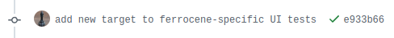
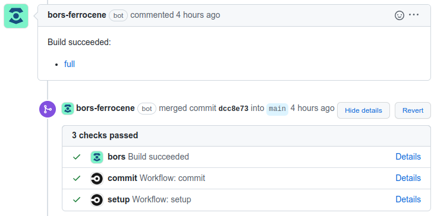

.. SPDX-License-Identifier: MIT OR Apache-2.0
   SPDX-FileCopyrightText: The Ferrocene Developers

.. default-domain:: qualification

Build and Testing Process
=========================

The Ferrocene CI infrastructure serves two purposes: testing every PR to make
sure it meets Ferrocene's quality standards, and building the release binaries
with the changes of that PR.

CI tests every PR, regardless of whether it modifies the toolchain,
documentation, tests, configurations, or any other artifact within the
Ferrocene repository. This ensures that regardless of what the change is, all
verification activities are performed successfully, and the branch remains
"green".

Building and packaging release binaries is also done by CI for every PR, as
part of the same workflow used for testing. Building and storing packages for
every PR simplifies the release process (as it can reuse the binaries built by
CI), and allows quick bisection to identify the change that introduced a bug.

Updating Tests Suites
---------------------

As part of the testing process, it is essential to ensure that the test suites
are adapted to the evolution of Ferrocene. Consequently, the creation of new
tests or updates of existing tests suites is required:

* Updates for test suites maintained by upstream are merged whenever we pull
  new changes in.

* Updates for test suites maintained by Ferrocene are done as part of
  the :doc:`development`.

.. _ci-phase-spot:

Build and Test Phase 1: Spot Testing
------------------------------------

The goal of this phase is to quickly assess the health of a PR by detecting
merge issues, running linters, and testing for common issues. It is executed as
a convenience for developers, and doesn't perform any check not performed in
:ref:`ci-phase-full`.

This phase is triggered whenever a new PR is created, or a new commit is pushed
under a PR. CircleCI starts the ``commit`` workflow. This workflow performs the
following steps:

* Prepare a Docker image of the build environment.
* Perform licensing checks.
* Run linters on the codebase.
* Build the Ferrocene toolchain.
* Run the subset of tests most likely to fail due to a change.

If this phase is successful, the Ferrocene CI infrastructure reports a pass in
the comment section of the PR with a green check mark:

   Spot Testing Success

If this phase fails however, the Ferrocene CI infrastructure reports a failure
in the comment section of the PR with a red X:

.. figure:: figures/test-failure-msg.png

   Spot Testing Failure

.. _ci-phase-full:

Build and Test Phase 2: Full Build and Test
-------------------------------------------

The goal of this phase is to validate the PR, build and package release
artifacts, and merge it into the target branch. The phase starts when
:ref:`dev-phase-test` is reached. CircleCI then runs the ``full`` workflow
within a pipeline, performing the following steps:

* Prepare a Docker image of the build environment.
* Build the Ferrocene toolchain.
* Run all test suites on all supported targets using the toolchain.
* Render the documentation, including the outcomes of the tests.
* Package the toolchain.
* Upload the package to Amazon S3.
* Prepare a Docker image of the installation environment.
* Download the package from Amazon S3.
* Verify the contents of the package.
* Install the toolchain.
* Verify the versions and functionality of the toolchain binaries.
* Generate a report.

If the "full" workflow executes successfully, then the merge commit is
fast-forwarded to the ``main`` branch and a new PR is pulled out of the queue to
be tested, and the Ferrocene CI infrastructure reports a successful full build
and successful merge in the comment section of the PR.

   Full Workflow Success

If the "full" workflow fails, the current PR is moved back to
:ref:`dev-phase-review`, and the Ferrocene CI infrastructure reports a failed
full build in the comment section of the PR and prevents the merge until the
failure is fixed.

.. figure:: figures/bors-failed-workflow.png

   Failed Workflow

Storing Test Results
--------------------

All test results are compressed into a tarball which is included in the release
artifacts and stored on AWS S3 alongside the binaries and documentation we ship
to customers. For qualified releases, those are retained in the S3 bucket
indefinitely.

.. _bare-metal-testing:

Bare metal testing
------------------

Some Ferrocene targets are meant to be used in an environment without any
operating system. Consequently, they don't include APIs relying on one (as part
of the ``std`` crate), and only include the ``core`` and ``alloc`` crates,
which are OS-independent.

Unfortunately, Rust's test suites require those APIs (and in general an
operating system) to be available in order to invoke the tests themselves and
to report the execution results.

To solve the issue, our approach is to create a new target based on the Rust
target we need to test: this new "bare metal testing target" has the same
configuration as the real target, with the only exception being enabling the
operating system bindings for Linux. This new target won't be shipped to
customers.

The bare metal testing target allows us to execute the test suite on Linux
(running on the hardware needed by the real target), side-stepping the
requirement to have an operating system.

Since the only difference between the two targets is the implementation of the
APIs in the ``std`` crate. and that crate is not shipped to customers for bare
metal targets, we can conclude that the test results of the two targets are
equivalent.
