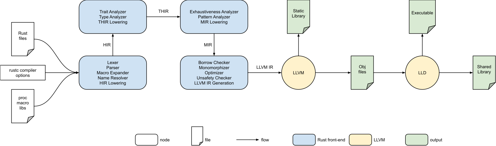
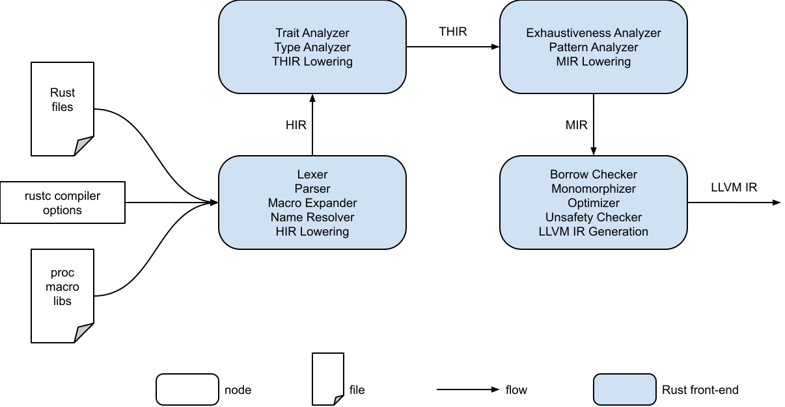
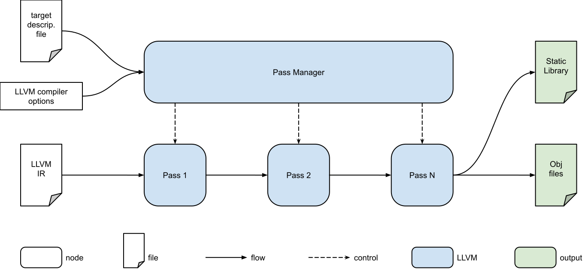
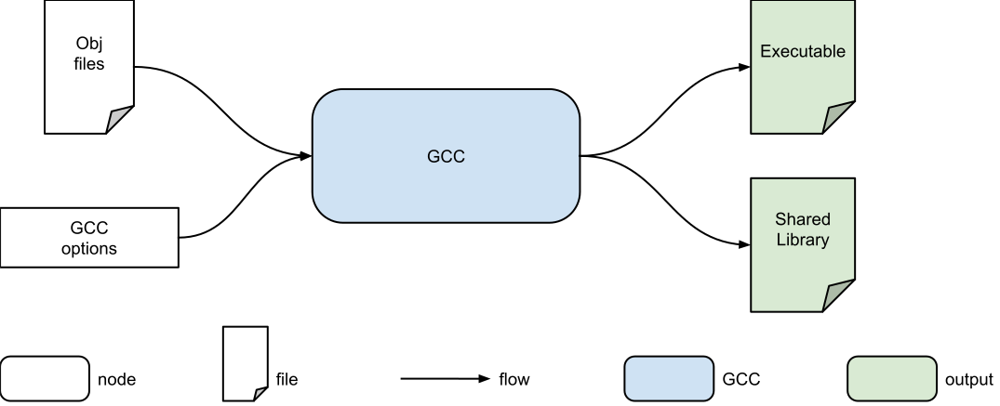

.. SPDX-License-Identifier: MIT OR Apache-2.0
   SPDX-FileCopyrightText: The Ferrocene Developers

Ferrocene Details
=================

The Ferrocene toolchain consists of the ``rustc`` compiler driver, which
internally invokes the Rust Front-End, LLVM, and GCC (as a linker only), in
order to produce a library or an executable from an input Rust program.

   Ferrocene Architecture

Rust Front-End
--------------

The Rust Front-End is responsible for verifying the syntax and semantics of a
Rust program, and for translating the program into LLVM IR for processing by
LLVM.

   Rust Front-End Architecture

Front-End: Internal Representations
^^^^^^^^^^^^^^^^^^^^^^^^^^^^^^^^^^^^

The Rust Front-End employs several internal representations to model the syntax
and semantics of a Rust program.

:AST: The Abstract Syntax Tree (AST) is the first representation employed by
      Ferrocene to model a Rust program. The AST precisely captures the
      structure of a Rust program and how the various items nest inside a
      containment hierarchy. The AST is produced by the Parser.

:HIR: The High-Level Intermediate Representation (HIR) is the second
      representation employed by Ferrocene to model a Rust program. The HIR is
      based on the AST, where certain complex constructs are simplified down to
      more primitive constructs.

:THIR: The Typed High-Level Intermediate Representation (THIR) is the third
       representation employed by Ferrocene to model a Rust program. The THIR is
       based on the HIR, where all typing information has been captured.

:MIR: The Mid-Level Intermediate Representation (MIR) is the fourth and last
      representation employed by Ferrocene to model a Rust program. The MIR is a
      control flow graph that captures sequences of actions, decision points,
      and branching destinations.

Front-End: Processing
^^^^^^^^^^^^^^^^^^^^^

The processing performed by the Rust Front-End is based on semantic queries as
opposed to compilation passes, where a query can be issued on any construct
expressed in any of the internal representations outlined above.

To minimize the complexity and to present a more coherent view of the Rust
Front-End, we identify the following distinct "processors":

:Lexer: The Lexer processes a stream of characters that represent the text of a
        Rust program in order to produce lexical elements. The lexical elements
        are the most basic building blocks of a Rust program - comments,
        identifiers, keywords, literals, and special characters.

:Parser: The Parser uses the lexical elements produced by the Lexer to construct
         the AST, following the grammar of the Rust programming language. The
         Parser is capable of detecting violations of the grammar, and stops a
         malformed Rust program from advancing further into the Ferrocene
         compilation pipeline.

:Macro Expander: The Macro Expander leverages the Name Resolver and uses the AST
                 produced by the Parser to statically generate new syntax by
                 replacing macro invocations with the implementations of the
                 invoked macros. The Macro Expander is capable of detecting
                 improper macro invocations and impossible replacements, and
                 stops a malformed Rust program from advancing further into the
                 Ferrocene compilation pipeline.

:Name Resolver: The Name Resolver uses the expanded AST produced by the Macro
                Expander to determine which paths refer to which names, which
                methods are being called by method call expressions, and which
                fields are selected by field access expressions. The Name
                Resolver is capable of detecting poor or ambiguous paths,
                non-existent methods, and non-existent fields, and stops a
                malformed Rust program from advancing further into the Ferrocene
                compilation pipeline.

:HIR Lowering: The process of HIR Lowering first checks various correctness
               properties of the AST, and then translates the AST to HIR. This
               phase prevents a malformed AST from being translated if a
               correctness property does not hold.

:Trait Analyzer: The Trait Analyzer pairs an implementation with a trait or a
                 type by satisfying the various implicit and explicit
                 constraints imposed by the trait or type. The Trait Analyzer is
                 capable of detecting incompatible implementations, and stops a
                 malformed Rust program from advancing further into the
                 Ferrocene compilation pipeline.

:Type Analyzer: The Type Analyzer infers and verifies the types of expressions
                and values based on the type system of the Rust programming
                language. The Type Analyzer is capable of detecting incompatible
                types, and stops a malformed Rust program from advancing further
                into the Ferrocene compilation pipeline.

:THIR Lowering: The process of THIR Lowering translates the HIR into THIR.

:Exhaustiveness Analyzer: The Exhaustiveness Analyzer uses type information to
                          determine whether the alternatives of a match
                          expression fully cover the range of a type. The
                          Exhaustiveness Analyzer is capable of detecting
                          sub-ranges without coverage, and stops a malformed
                          Rust program from advancing further into the Ferrocene
                          compilation pipeline.

:Pattern Analyzer: The Pattern Analyzer uses type information to determine
                   whether a single pattern or a tree of patterns can fully
                   capture a value. The Pattern Analyzer is capable of detecting
                   incomplete patterns and values without full capture, and
                   stops a malformed Rust program from advancing further into
                   the Ferrocene compilation pipeline.

:MIR Lowering: The process of MIR Lowering translates the THIR into MIR.

:Borrow Checker: The Borrow Checker uses the control flow graph to verify the
                 ownership and borrowing system of the Rust programming
                 language. The Borrow Checker is capable of detecting data
                 aliasing situations that violate the memory safety of the
                 language, and stops a malformed Rust program from advancing
                 further into the Ferrocene compilation pipeline.

:Monomorphizer: The Monomorphizer uses the control flow graph to instantiate a
                generic by copying its template and replicating its generic
                parameters with generic arguments at appropriate instantiation
                sites.

:Optimizer: The Optimizer uses the control flow graph to perform inlining,
            machine-code layout, register allocation, and similar optimizations.

:LLVM IR Generation: The process of LLVM IR Generation translates the MIR into
                     LLVM IR.

LLVM
----

LLVM is responsible for the various optimizations of a LLVM IR program, and for
the generation of static libraries and object files.

   LLVM Architecture

LLVM: Internal Representations
^^^^^^^^^^^^^^^^^^^^^^^^^^^^^^^

LLVM employs only one internal representation, referred to simply as LLVM IR, to
model an input program.

LLVM IR is a portable high-level assembly language that employs a RISC
instruction set. It represents an input program as a containment hierarchy,
where each member of the hierarchy is supplemented with metadata. The LLVM IR
exists in Abstract Syntax Tree (AST) form, but it can also be persisted in
textual form.

LLVM: Processing
^^^^^^^^^^^^^^^^

:Pass: An LLVM Pass is an abstraction that represents a single isolated
       processing step. LLVM has a library of passes that cover various kinds of
       processing, from AST analysis, to optimizations, to persistence.

:Pass manager: LLVM employs a pass manager to orchestrate the passes necessary
               for a particular target, based on a target description file.

:Target description files: LLVM uses target description files to capture
                           target-specific information, such as register classes
                           and processing passes.

GCC Linker
----------

The GNU GCC linker is linker required by Ferrocene. It is
responsible for producing shared libraries and executables from object files.

   GCC Linker Architecture

Traditionally, GCC is used as a compiler for other programming languages. In the
context of the Ferrocene qualification, GCC is used in its capacity as a
linker, since it is aware of the system libraries on the host system.
