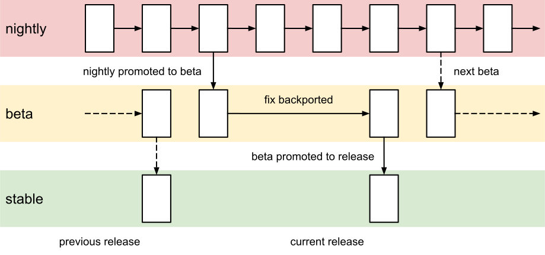

.. SPDX-License-Identifier: MIT OR Apache-2.0
   SPDX-FileCopyrightText: The Ferrocene Developers

History
=======

The Rust programming language was initiated as a personal project by Mozilla
researcher Graydon Hoare. After realizing its potential for efficient safety and
performance, the software company started sponsoring its development and
launched it in 2010. It was in that year that the Rust compiler, rustc, in the
form it is used today, was launched. From 2010 to 2015, Rust underwent many
iterations and experimentation up until the release of Rust 1.0 (May 2015),
which also established the first form of independent governance for the project.

Rust continues to be a highly iterative language, with a new stable release
every six weeks. It follows the “release trains” model (also used in web
browsers), with changes landing on the nightly builds first, then becoming
available in the beta release for six weeks, and finally reaching a stable
state.

When developing new features, Rust favors an “open” philosophy, making changes
available as soon as possible on the nightly builds behind experimental feature
flags. This allows users to test and provide feedback on new and experimental
features before their design and implementation is fully finalized, increasing
the confidence when those features are then stabilized.

From the beginning, Rust has emphasized performance, type safety, and
concurrency as a memory-safe language. Rust also focuses on the developer
experience, by providing great tooling around the language (such as the "cargo"
build system, the "rustdoc" documentation generator, the "Clippy" linter, and
the "Rust Analyzer" IDE plugin) and leading the industry in the quality and
usefulness of its compiler errors and warnings.

Today, the Rust project has an independent governance structure composed of many
teams, with both volunteers and corporate contributors leading the programming
language and its development. In 2021, the Rust project created the Rust
Foundation, a non-profit organization “dedicated to stewarding the Rust
programming language, nurturing the Rust ecosystem, and supporting the set of
maintainers governing and developing the project”. The Rust Foundation does not
make technical, language or governance decisions: it has a support role for the
project, providing crucial funding, employment of key roles, and legal support.

"Ferrocene", started in 2021 after years of planning, is a qualified Rust compiler
with a focus on the ISO 26262 standard for the automotive industry.
It is maintained by Ferrous Systems, which also qualifies new versions of
the Rust compiler, as required in safety and mission-critical settings.

The Rust Project
----------------

The Rust project, also referred to as "upstream", is an umbrella project that
encompasses contributions from individuals and dedicated teams, and is sponsored
by interested companies through the Rust Foundation.

The responsibilities within the Rust project are split across several teams with
dedicated roles:

* Leadership council - Manages the overall direction of Rust, provides subteam
  leadership, and addresses any cross-cutting issues.

* Language team - Evolves the Rust programming language and helps with the
  implementation of new language features.

* Compiler team - Develops and manages the Rust compiler technology.

* Library team - Develops and manages the Rust standard library and official
  crates.

* Crates.io team - Develops, manages, and operates crates.io, the online
  repository for Rust crates.

* Infrastructure team - Manages the infrastructure of the Rust project,
  including CI, releases, bots, and metrics.

* Release team - Tracks regressions and stabilizations, and produces new Rust
  releases.

* Dev tools team - Develops and manages the Rust development tools.

* Moderation team - Helps to uphold the code of conduct and community standards.

Upstream Release Schedule
-------------------------

The upstream releases follow a software release train model, with three release
channels: nightly, beta, and stable.

All upstream development is done on the master branch of the upstream GitHub
repository. Every night, the upstream release infrastructure takes the latest
commit on the master branch and produces a nightly release.

Once a stable release takes place, the upstream release infrastructure promotes
the nightly release of that day to beta release on a beta branch. When a bug or
a regression is fixed, the associated commit is merged into the master branch,
and also backported into the beta branch to produce a new beta release.

Every six weeks, the upstream release infrastructure promotes the last beta
release to a stable release on a stable branch. The stable branch is on a fixed
schedule, so developers are always aware of when the next release will be
available for download.

The following diagram shows how the Upstream release trains work:

   Upstream Release Train

Contributing to Upstream
------------------------

A developer may contribute to upstream by either requesting a feature to be
developed, reporting a bug, submitting a Pull Request for review and merging into
the master branch, or writing documentation.

The procedures and guidelines for contributing to upstream are outside the scope
of this document, and can be found at
https://rustc-dev-guide.rust-lang.org/contributing.html.
