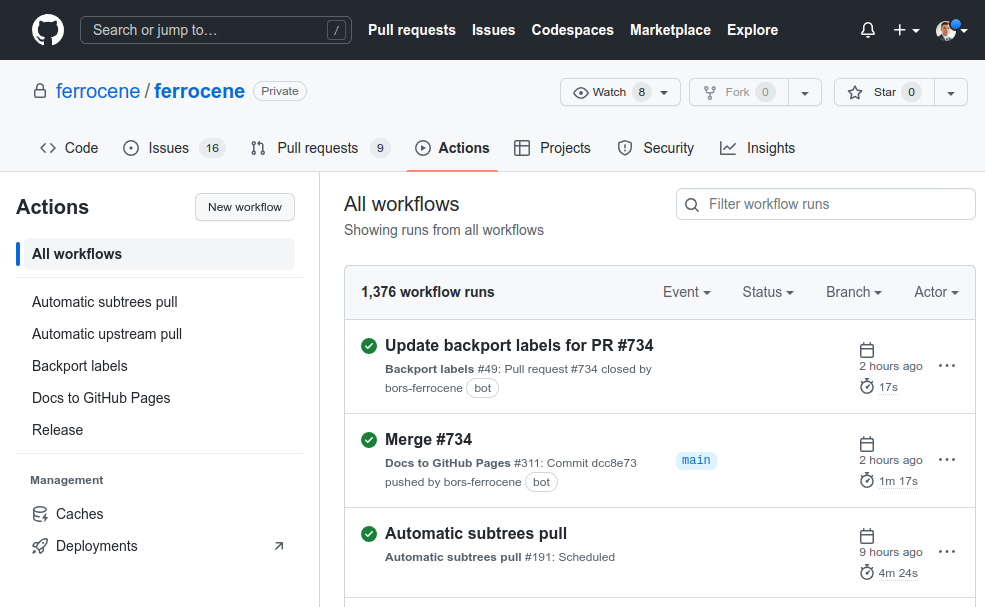
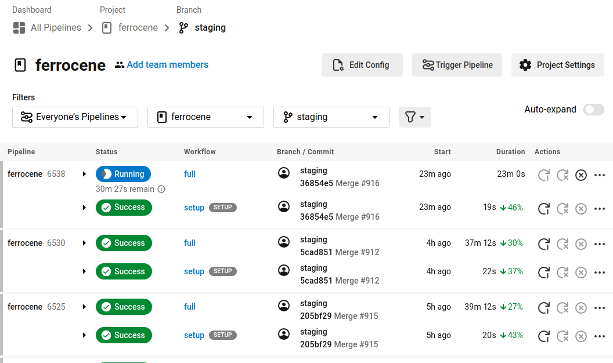
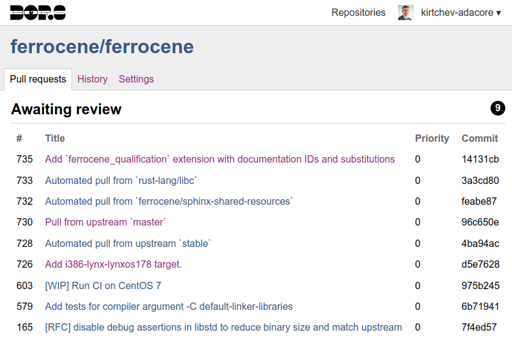

.. SPDX-License-Identifier: MIT OR Apache-2.0
   SPDX-FileCopyrightText: The Ferrocene Developers

.. default-domain:: qualification

Infrastructure
==============

The Ferrocene CI infrastructure is the foundation upon which the various
Ferrocene processes are built. The components of the Ferrocene CI infrastructure
are described below.

GitHub
------

GitHub is an Internet hosting service for software development and version
control using ``git``. GitHub provides distributed version control, access
control, change review, change testing and validation, bug tracking, software
feature requests, task management, CI, and wikis.

The sources of the Ferrocene toolchain, including but not limited to the
compiler, libraries, test suites, documentation, qualification material, helper
tools, configuration, all reside in a public repository referred to as the
"Ferrocene GitHub repository", "``ferrocene/ferrocene``", or "the monorepo".

Hosting the Ferrocene toolchain in a single repository allows the Ferrocene
operations team to uniquely identify each snapshot of the toolchain by its
commit ID and to package snapshots into releases. For further details of the
different releases, see :ref:`release:Release Process`.

GitHub Actions
--------------

GitHub Actions is a CI/CD platform provided by GitHub that is used to automate
building, testing, and deployment of software.

GitHub Actions offers the following automation features, from most detailed and
low-level to most general and high-level:

* An *action* is a custom application that performs a complex but frequent
  repetitive task.

* A *job* is a set of *steps* that are either expressed as shell scripts or as
  actions. Steps are executed based on their ordering and dependencies, where
  data can be shared between steps.

* A *workflow* is a configurable automated process that runs one or more jobs.
  Workflows are triggered by events, and executed by runners.

* An *event* is a specific activity associated with a GitHub repository, such as
  opening an issue or creating a PR.

* A *runner* is a server that executes triggered workflows.

While Ferrocene does not use GitHub Actions to perform CI builds as of today,
GitHub Actions is used to automate various Ferrocene processes that would
otherwise require manual intervention, such as opening daily PRs or performing
releases. The following screenshot shows the GitHub Actions of the Ferrocene
GitHub repository.

   GitHub Actions

CircleCI
--------

CircleCI is a CI/CD platform that launches a build with each new commit using
a *pipeline*. CircleCI automatically tests builds in either Docker containers
or virtual machines, and deploys passing builds to target environments. The
CircleCI UI allows for the monitoring of pipelines, restarting workflows, etc.

The Ferrocene CI infrastructure utilizes multiple pipelines that perform builds
and execute tests for the various Ferrocene release channels. The following
screenshot shows the CircleCI UI for the ``main`` branch of the Ferrocene GitHub
repository.

   CircleCI UI

Bors
----

Bors is a GitHub bot that prevents merge skew and semantic merge conflicts,
resulting in branches that are always "green" (always pass all tests).

At a high level, bors maintains an ordered queue of PRs. On regular intervals
bors collects all PRs that are in the queue onto a batch, and tries to merge the
whole batch. If a batch merge fails, bors would fail the batch and bisect to
discover the problematic PR.

The Ferrocene CI infrastructure relies on bors to avoid merge complications,
such as the following complex scenario:

    Imagine that there are two parallel branches in a codebase containing the
    ``drive()`` function - one branch adds a new module invoking the ``drive()``
    function, while the other branch removes the ``drive()`` function and all of
    its callees.

    Both branches will pass the full test suite, as the first branch calls an
    existing function and the second branch makes sure all the other functions
    calling ``drive()`` are removed. If a developer were to merge both branches,
    the resulting main branch would fail the test suite, as the new module would
    try to invoke the removed ``drive()`` function.

In the Ferrocene CI infrastructure, bors is configured to be the only entity
capable of merging a PR into the ``main`` branch or any of the release branches,
where all other means of merging, such as the "merge" button of GitHub or manual
commands performed through ``git``, have been disabled. The following screenshot
shows the Bors UI for the Ferrocene GitHub repository.

   Bors UI

Test Suites
-----------

The Ferrocene CI infrastructure relies on the test suites outlined in
:external+evaluation-report:doc:`Qualification Method of the Evaluation Report
<method>` to validate a PR. These test suites verify that the Ferrocene
toolchain behaves as intended, and that documentation is properly built and
updated.

The Ferrocene CI infrastructure maintains logs for each test for one year
for stable and qualified branches. These logs include but are not limited
to pass/fail status, its run/ignored status, the machine configuration and
environment used when executing the test, the output of the test, the time
of execution, the duration of execution.

Emulators
---------

The Ferrocene CI infrastructure employs the QEMU emulator to emulate non-native
targets such as ``aarch64``. QEMU is integrated into CircleCI.

Amazon ECR and S3
-----------------

Amazon ECR is a Docker container registry for storage, sharing, and deployment
of container images offered by Amazon.

Amazon S3 is an object storage with a web service interface offered by Amazon.

The Ferrocene CI infrastructure stores pre-built Docker images in Amazon ECR
and all Ferrocene-related build artifacts, caches, and mirrored software
installers in Amazon S3.
