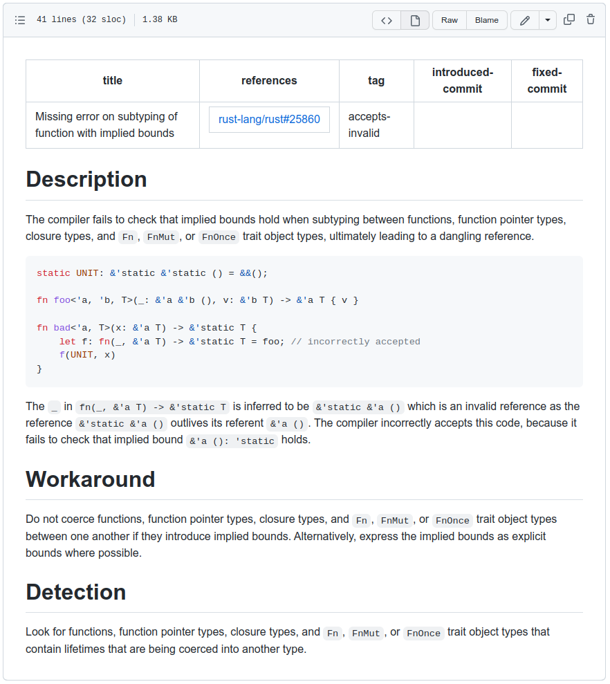

.. SPDX-License-Identifier: MIT OR Apache-2.0
   SPDX-FileCopyrightText: The Ferrocene Developers

.. default-domain:: qualification

Known Problems Tracking
=======================

Newly discovered KPs and previously fixed KPs in stable releases are documented
in dedicated KP files, which are then collated into a KP Manual. The KP Manual
is made available to customers either in stand-alone fashion, or as an addition
to the Safety Manual. Customers are expected to consult the KP Manual in order
to verify the applicability of the KPs for their versions of the toolchain.

Each KP file has the following format:

* ``title``: A short description of the KP.

* ``references``: A list of links to GitHub issues and other ticket management
  systems that track the KP.

* ``tag``: A designator of the KP severity. The tags are as follows:

  * ``wrong-compiler-code``: The KP causes rustc to generate wrong code.

  * ``wrong-library-code``: The KP causes a Ferrocene library to generate
    wrong code.

  * ``wrong-linking``: The KP causes the linker to either incorrectly link a
    symbol or fail to link altogether.

  * ``accepts-invalid``: The KP causes rustc to accept invalid code, and
    possibly generate wrong code.

  * ``diagnostic``: The KP causes rustc to suppress a safety-related error
    diagnostic, or emit a spurious safety-related error diagnostic.

* ``introduced-commit``: The commit number when the KP was introduced.

* ``fixed-commit``: A set of commit numbers belonging to various releases that
  contain the fix for the KP.

* ``duplicate``: The KP this KP is a duplicate of. This field is only used when it becomes known
  that a KP is a duplicate after it has already been recorded.

* ``test-paths``: A set of paths to tests within the ferrocene repository that verify that the KP
  has been successfully fixed.

* ``Description``: A detailed description of the KP, possibly accompanied by
  code examples.

* ``Workaround``: A mitigation strategy for avoiding the KP.

* ``Detection``: A textual description of methods for detecting the KP.

* ``Mitigation``: A textual description of methods for fixing detected occurences of a KP in code.

In addition, the field ``Affected branches`` is available in the KP Manual. This field shows which branches the KP impacts.

The following screenshot shows the contents of a KP.

   Known Problems Example

A KP may be identified through several sources:

* An upstream GitHub issue with label l-unsound is opened.

* A customer reports a bug.

* A Ferrocene developer reports a bug.

* Some other source, e.g. an article, mailing list, or newsgroup of interest
  observes a defect.

Regardless of its source, a KP receives a dedicated entry in the KP manual.
Once a fix for the KP has been found, the fix goes through the
:ref:`development:Development Process`. Any reproducers are retained as
regression tests and are integrated into the Ferrocene test suite.
