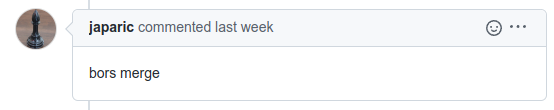
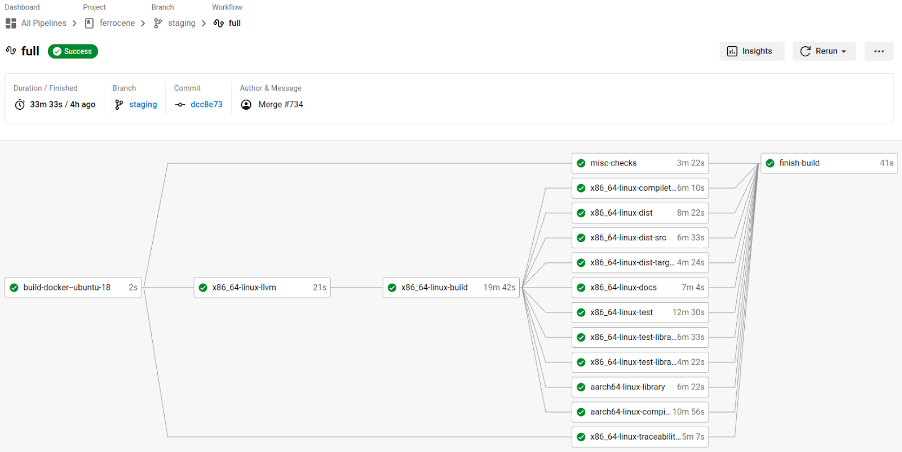

.. SPDX-License-Identifier: MIT OR Apache-2.0
   SPDX-FileCopyrightText: The Ferrocene Developers

.. default-domain:: qualification

Testing Process
===============

The Ferrocene CI infrastructure tests every PR, regardless of whether the PR
modifies the tool chain, documentation, tests, configurations, or any other
artifact within the Ferrocene GitHub repository. This ensures that regardless
of what the change is, all verification activities are performed successfully,
and the branch remains "green".

Updating Tests Suites
---------------------

As part of the testing process, it is essential to ensure that the test suites
are adapted to the evolution of Ferrocene. Consequently, the creation of new
tests or updates of existing tests suites is required.

When a new feature is developed, the author of the PR is also responsible for
creating tests to ensure that the feature works as intended. These tests are
required to ensure that future PRs do not negatively impact the functionality
of the feature.

New tests provide the following information, and are linked to a GitHub issue or
a PR that prompted their creation.

* Test name and test reference

* Introduced commit

* Scope of tests

* (optional) Test Platform

* Pass/Fail criteria

Once the tests are developed, the process continues with the 
:ref:`development:Development Phases` to be merged in the test suite.

Changes to upstream test suites are merged as part of the automated PRs pulling
code from upstream.

KPs can also result in additional tests to be developed or modified. For the
details on handling KPs, refer to :ref:`kp-tracking:Known Problems Tracking`.
The tests developed for KPs provide the same information mentioned above and
follow :ref:`development:Development Process` to be merged into the test suite.

Test Phase 1: Trial Merge and Spot Testing
------------------------------------------

The goal of this phase is to quickly assess the health of a PR by detecting
merge issues, and testing for common issues.

This phase is triggered whenever a new PR is created, or a new commit is pushed
under a PR. CircleCI starts the "commit" workflow. This workflow performs the
following steps:

* Prepare a Docker image of the build environment.
* Perform licensing checks.
* Build the Ferrocene toolchain.
* Run selected tests on a subset of supported targets to spot check the
  toolchain.

If this phase is successful, the Ferrocene CI infrastructure reports a pass in
the comment section of the PR with a green check mark:

.. figure:: figures/test-success-msg.png

   Spot Testing Success

If this phase fails however, the Ferrocene CI infrastructure reports a failure
in the comment section of the PR with a red X:

.. figure:: figures/test-failure-msg.png

   Spot Testing Failure

Test Phase 2: Full Testing and Merge
------------------------------------

The goal of this phase is to validate the PR, and merge it into the branch.

Once a PR is approved by a human reviewer, the Ferrocene developer or the
Reviewer can instruct the Ferrocene CI infrastructure to perform full testing
and merge the PR into the branch by posting comment "bors merge" (or one of its
equivalents) in the comment section of the PR.

   Bors Merge Request

When this happens, CircleCI runs the "full" workflow within a pipeline. This
workflow performs the following steps:

* Prepare a Docker image of the build environment.
* Build the Ferrocene toolchain.
* Run all test suites on all supported targets using the toolchain.
* Package the toolchain.
* Upload the package to Amazon S3.
* Prepare a Docker image of the installation environment.
* Download the package from Amazon S3.
* Verify the contents of the package.
* Install the toolchain.
* Verify the versions and functionality of the toolchain binaries.
* Generate a report.

   Full Workflow Pipeline

If the "full" workflow executes successfully, then the merge commit is
fast-forwarded to the ``main`` branch and a new PR is pulled out of the queue to
be tested, and the Ferrocene CI infrastructure reports a successful full build
and successful merge in the comment section of the PR.

.. figure:: figures/full-workflow-success.png

   Full Workflow Success

If the "full" workflow fails, the current PR is moved back to 
:ref:`development:Dev Phase 2: Code Review` or :ref:`documentation:Doc Phase 2: 
Document Review` respectively, and the Ferrocene CI infrastructure reports a
failed full build in the comment section of the PR and prevents the merge until
the failure is fixed.

.. figure:: figures/bors-failed-workflow.png

   Failed Workflow

Storing Test Results
--------------------

All test results are compressed into a tarball which is included in the release
artifacts and stored on AWS S3 alongside the binaries and documentation we ship
to customers. For qualified releases, those are retained in the S3 bucket
indefinitely.
