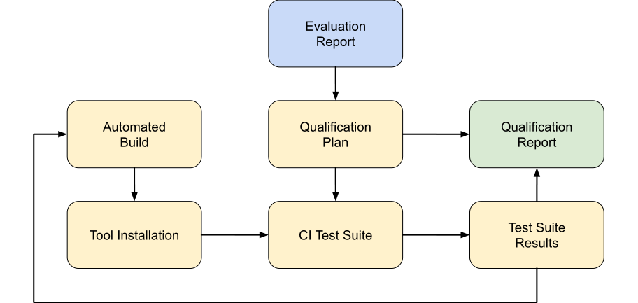

.. SPDX-License-Identifier: MIT OR Apache-2.0
   SPDX-FileCopyrightText: The Ferrocene Developers

Validation Process
==================

   Validation Process

As described in the picture above, the validation process starts with the
results of the :doc:`evaluation-report:index`. After the analysis of the
software tool identified the use cases and the potential errors, we determined
the Tool Confidence Level and then the validation method used for this
qualification.

The validation process shall demonstrate that all the potential errors have
been identified for the use case described in the Evaluation Report HazOp
analysis.  These errors will either be covered by a test which ensures that
they are not present in the final product, or means of mitigating their effects
have been identified (see :doc:`evaluation-report:rustc/tool-analysis` for further
details).

Validation Strategy
-------------------

The general validation strategy employed across the Ferrocene processes is to
use a trusted CI infrastructure to thoroughly test a PR, to prevent the merge
of a PR that would otherwise violate the :ref:`"always green" invariant
<infrastructure:Bors>` of the Ferrocene Git repository, and to maintain logs
and artifacts for every single activity that was performed for some Ferrocene
process.

The Ferrocene CI infrastructure implements the general validation strategy, and
in addition allows a Ferrocene developer to stop any phase of any Ferrocene
process, and to examine any log at any point during the span of an activity.

The following sections describe how the various Ferrocene processes are
validated.

Development Validation
----------------------

The validation of the :doc:`development` is performed in part by the reviewer
of each PR, and in part automatically by the Ferrocene infrastructure.

Whenever a PR is ready for review, in addition to reviewing the code change,
the reviewer must ensure these steps were followed before marking the PR as
approved:

* :ref:`dev-phase-design`
* :ref:`dev-phase-development`
* :ref:`dev-phase-review`

Once the PR is queued to be merged, the Ferrocene infrastructure will
automatically verify that the reviewer approved the PR (meaning the steps above
were checked by the reviewer), and run these steps before merging the change:

* :ref:`dev-phase-queue`
* :ref:`dev-phase-test`

Because of this, all merged changes have followed the development process, and
there is no need for any additional manual verification.

.. _documentation-validation:

Documentation validation
~~~~~~~~~~~~~~~~~~~~~~~~

In addition to this process, the safety manager (or a person delegated by the
safety manager) must review the documents before each release, checking that
the documentation's contents are valid, up-to-date, and complete, and that all
applicable requirements have been successfully covered.

They must also do a quick check to ensure there are no unexpected problems
with the end product and that the automation successfully executed without
warnings.

Quick checks should always include ensuring:

* :ref:`qualification-report:requirements-traceability` is still satisfied
* :ref:`qualification-report:test-results-overview` shows expected counts
* The Specification documents the right version
* :ref:`release-notes:index`
  * Displays the correct version
  * Does not have an ``:upcoming-release:`` tag
  * Follows the process in :ref:`release-notes-maintenance`

Build and Testing Validation
----------------------------

The :doc:`ci` is performed as part of the development process in
:ref:`dev-phase-test`, so validating it implies validating the testing process.

Additionally, the produced packages are validated automatically by the release
tooling as part of the Ferrocene infrastructure. The tooling expects the
packages to be stored at the correct location with the right metadata attached,
so failures in the packaging process will prevent releases from being
published.

.. _release-validation:

Release Validation
------------------

The validation of the release process is only applicable to the stable release
channel. As indicated in :doc:`release`, there are no stability or
functionality guarantees in the other release channels as they are not
production environments.

To validate a release, the release manager must first publish the release on
the ``dev`` environment (as described :ref:`in the internal procedures
<internal-procedures:publish-stable>`), and once published there they must
manually verify that:

* All the expected files are present in the release.

* The release can be installed locally and can compile example programs.

* The :ref:`documentation-validation` has been performed.

If any of the checks are not satisfactory, the release must be delayed until
resolved. Once all checks are passed, the release can be published in the
production environment.
